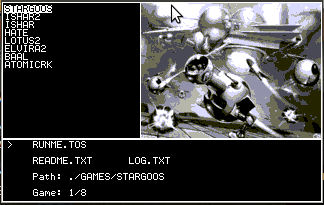

# sdlLauncher #

sdlLauncher is a full-screen game browser/launcher tool for various retro computers. It is intended to run at system boot and present the user with a list of detected games along with screenshots and any supported documentation (readme files included with the game, etc.).

Here is an example of what it looks like:

... in the example above it is configured in Atari ST / TOS mode, hence is limited to 16 color greyscale.

The inspiration for this is [iGame](http://winterland.no-ip.org/igame/screenshots.html) for the Amiga, for which there is no direct equivalent for the Atari ST or Risc OS platforms.

This is ideal for *the armchair gamer* who does not want to browse the desktop for a game!

## Functionality ##

 * Automatic enumeration of games in a user-defined drive or directory *- i.e set a directory and the application will search for any games found in a sub-folder*.
 * Scrollable list of all available games.
 * Automatically load any bitmaps found in the game sub-folder as its cover or screenshot.
 * List any .txt files found in the game sub-folder and allow the user to view them without returning to the desktop (e.g. for readme or instruction files).
 * Save game list and metadata to .csv file to speed up subsequent application load times.

## Supported Platforms ##

sdlLauncher was developed on x86 Linux, and is intended to be run on the following platforms:

 * Linux *- testing/development only*
 * Atari ST / STE / Mega ST
 * Risc OS *- not yet implemented*

## Pre-requisites ##

sdlLauncher is self-contained, other than the `ASSETS` folder which contains images and icons and should be placed where your binary runs from, there are *no* external dependencies to run the application.

# Compiling from source #

### Native Linux

The following libraries are needed to build sdlLauncher from source on Linux and other unix-like platforms (including Cygwin):

 * libsdl1.2
 * GNU libc

Linux platforms can run the shell script `scripts/build.unix` to compile the application.

If you need to adjust any library or include paths, please edit the file `Makefile.unix`.

### Atari ST / TOS

Compiling for Atar ST / TOS is supported using standard GNU cross-compiler toolchains.

You will need the full *m68k-atari-mint-** set of GNU tools. This includes:

 * [gcc & libc](http://tho-otto.de/crossmint.php)
 * [binutils](http://tho-otto.de/crossmint.php)

In addition, you need the following `m68k-atari-mint` library to resolve several TOS/GEM symbols:

 * [GEMlib](http://tho-otto.de/crossmint.php)

libSDL 1.2 for `m68k-atari-mint` targets can be found (including a number of bug fixes) from Patrice Mandin:

 * [libSDL 1.2.15](http://pmandin.atari.org/en/index.php?post/2015/11/01/121-en-ports-libs-sdl) - this must be, at a minimum, the *SDL-devel-1.2.15-mint-20190113* release, as earlier versions have a bug in the display code

Download and install all of these (which defaults to `/usr/m68k-atari-mint/`). You can then run the shell script `scripts/build.tos` to compile the application.

The makefile `Makefile.tos` contains paths to the cross compiler and libraries listed above. If you've installed them to a different location, make sure to edit the makefile.

A successful build will generate a binary named `menu.tos` which can be run from the Atari GEM desktop, or (preferably) dropped into the `AUTO` folder to automatically run on system boot.

Compiling using native tools on TOS itself is *untested*.

### Risc OS

*Not yet implemented*